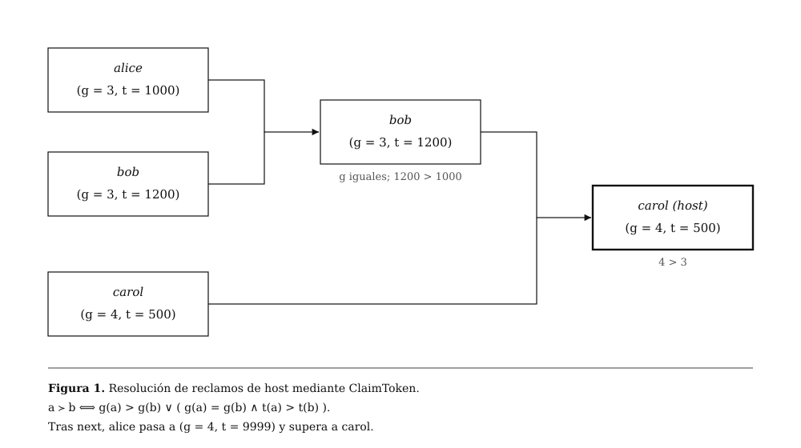
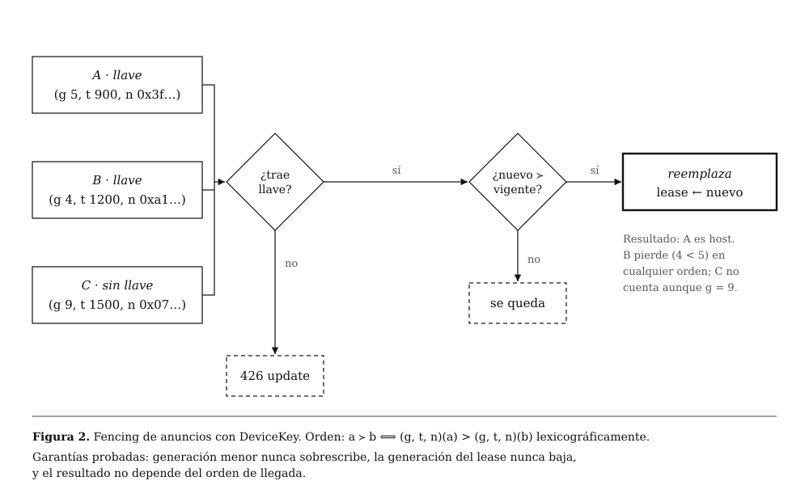

# jukz-lean

Aquí voy probando en Lean las reglas de [jukz](https://github.com/Nuulz/jukz), mi mod de Minecraft para hostear mundos P2P sin servidor.

Si dos personas intentan ser host del mismo mundo al mismo tiempo, tiene que ganar siempre la misma, sin importar quién llegó primero. En jukz eso ya funciona, pero quería demostrarlo de verdad y no solo confiar en los tests.

Lo voy subiendo de a poco, un nivel por carpeta.

## 01 ClaimToken

El token básico tiene generación, timestamp y nodeId. Gana la generación más alta.

## 02 DeviceKey y fencing

Ahora los clientes viejos sin llave de dispositivo se rechazan, y el orden completo es generación, después timestamp y después nodeId, igual que en el worker.

Está probado que una generación menor nunca le pasa por encima a una mayor, que la generación del host nunca baja y que da igual en qué orden lleguen los anuncios, siempre gana el mismo.

## Probarlo

Necesitas [elan](https://github.com/leanprover/elan). Entras a cualquier nivel y corres `lake build`. Si compila, todas las pruebas pasan.
